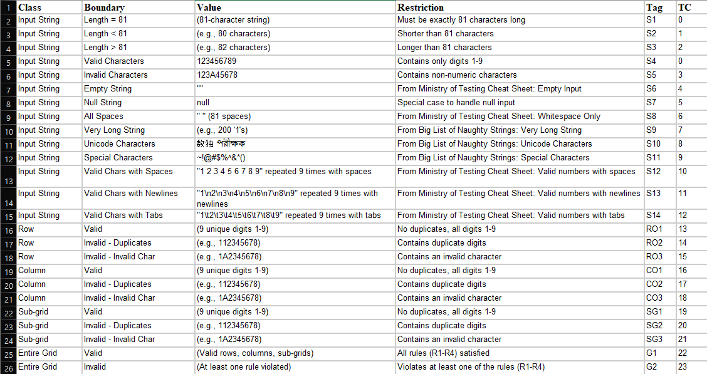
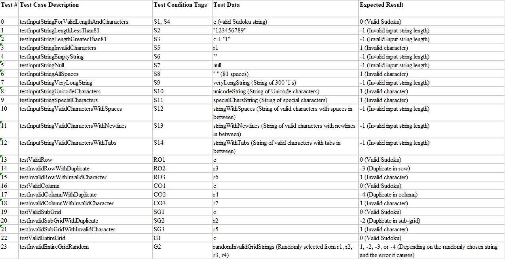
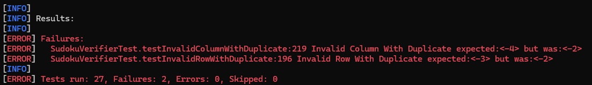
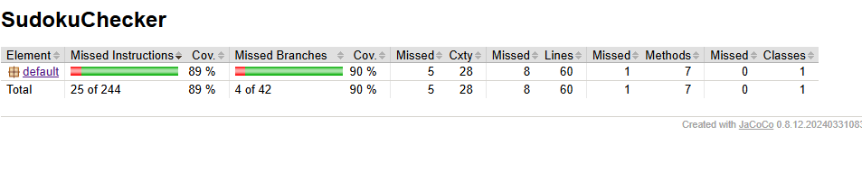
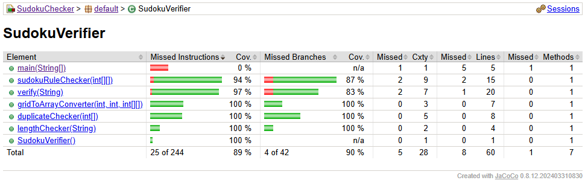

# Sudoku Verifier - Black-Box Testing

## 1. Introduction

This project implements a Sudoku verifier in Java and a comprehensive suite of JUnit tests to validate its functionality.
The verifier was developed and tested following a black-box testing approach, focusing on the input and output behavior 
without considering the internal implementation details. The project was completed as part of a software testing and 
quality course, following the steps outlined in the provided instructions.

## 2. Project Information

Original project where the code was forked from: https://github.com/M3SOulu/SudokuChecker.git

The original project was refactored to use Maven for dependency management. This involved restructuring the project to 
conform to Maven's standard directory layout and creating a `pom.xml` file to define project dependencies and build 
configurations, including:

*   JUnit for unit testing.
*   JaCoCo for code coverage analysis.
*   PITest for mutation testing.

## 2.1. Project Structure

The project consists of the following main files:

*   **`SudokuVerifier.java`:** Contains the `SudokuVerifier` class, which implements the Sudoku validation logic.
*   **`SudokuVerifierTest.java`:** Contains the JUnit test suite for the `SudokuVerifier` class.
*   **`TestRunner.java`:** (Optional) A simple class for running the tests from the command line.
*   **`pom.xml`:** The Maven configuration file defining project dependencies and build settings.
*   **`images/`:** A folder containing images used in this README.

## 3. Sudoku Rules

A valid Sudoku solution must adhere to the following rules:

1.  **R1 (Cell Values):** Each cell must contain a single digit from 1 to 9.
2.  **R2 (Sub-grid Uniqueness):** Each 3x3 sub-grid must contain all digits from 1 to 9 without repetition.
3.  **R3 (Row Uniqueness):** Each row must contain all digits from 1 to 9 without repetition.
4.  **R4 (Column Uniqueness):** Each column must contain all digits from 1 to 9 without repetition.

## 4. Implementation

The Sudoku verifier is implemented in the `SudokuVerifier.java` file. The core logic resides in the `verify()` method, 
which accepts a candidate Sudoku solution as a string and returns an integer code indicating the result of the verification:

*   **0:** Valid Sudoku
*   **1:** Invalid character (non-numeric, or not in range 1-9)
*   **-1:** Invalid input string length (not 81 characters) or a number is out of range 1-9
*   **-2:** Duplicate in sub-grid
*   **-3:** Duplicate in row
*   **-4:** Duplicate in column

## 5. Testing

The `SudokuVerifierTest.java` file contains a comprehensive suite of JUnit tests that use black-box testing techniques 
to validate the `verify()` method.

### 5.1. Testing Techniques

The following black-box testing techniques were employed:

*   **Equivalence Class Partitioning:** The input domain (Sudoku strings) was divided into equivalence classes based on 
    valid and invalid conditions derived from the Sudoku rules and input format.

*   **Boundary Value Analysis:** Test cases were designed to specifically target boundary values, such as empty strings, 
    strings of length 80 and 82, and valid digits at cell boundaries.

*   **Checklist-Based Testing:** The following sources were used to generate test cases covering a wide range of 
    potentially problematic inputs, including special characters, Unicode characters, very long strings, and strings 
    with spaces, newlines, and tabs:
    *   [Ministry of Testing's Test Heuristics Cheat Sheet](https://www.ministryoftesting.com/articles/ab1cd85c)
    *   [Big List of Naughty Strings](https://github.com/minimaxir/big-list-of-naughty-strings)

### 5.2. Test Cases

The test cases are documented in the `SudokuVerifierTest.java` file and are designed to cover all relevant conditions 
identified in the Condition Table.

#### 5.2.1 Condition Table

The Condition Table systematically documents the identified equivalence classes, boundary values, and other test conditions.

#### 5.2.2 Test Case Table

The Test Case Table provides detailed specifications for each test case, including the test data and expected results.

## 6. Test Results

The test suite was executed using Maven and JUnit, and the results were analyzed to assess the correctness of the
`SudokuVerifier` implementation. The following table summarizes the test results:

| Test Case                             | Expected Result           | Actual Result | Pass/Fail |
| :------------------------------------ | :------------------------ | :------------ | :-------- |
| `testInputStringForValidLengthAndCharacters`      | 0 (Valid Sudoku)          | 0             | Pass      |
| `testInputStringLengthLessThan81`          | -1 (Invalid length)      | -1            | Pass      |
| `testInputStringLengthGreaterThan81`         | -1 (Invalid length)      | -1            | Pass      |
| `testInputStringInvalidCharacters`         | 1 (Invalid character)    | 1             | Pass      |
| `testInputStringEmptyString`               | -1 (Invalid length)      | -1            | Pass      |
| `testInputStringAllSpaces`                 | 1 (Invalid character)    | 1             | Pass      |
| `testInputStringVeryLongString`            | -1 (Invalid length)      | -1            | Pass      |
| `testInputStringUnicodeCharacters`         | 1 (Invalid character)    | 1             | Pass      |
| `testInputStringSpecialCharacters`         | 1 (Invalid character)    | 1             | Pass      |
| `testInputStringValidCharactersWithSpaces`  | 1 (Invalid character)    | 1             | Pass      |
| `testInputStringValidCharactersWithNewlines` | 1 (Invalid character)    | 1             | Pass      |
| `testInputStringValidCharactersWithTabs`    | 1 (Invalid character)    | 1             | Pass      |
| `testValidRow`                            | 0 (Valid Sudoku)          | 0             | Pass      |
| `testInvalidRowWithDuplicate`             | -3 (Duplicate in row)     | -2            | Fail      |
| `testInvalidRowWithInvalidCharacter`       | 1 (Invalid character)    | 1             | Pass      |
| `testValidColumn`                         | 0 (Valid Sudoku)          | 0             | Pass      |
| `testInvalidColumnWithDuplicate`          | -4 (Duplicate in column)   | -2            | Fail      |
| `testInvalidColumnWithInvalidCharacter`     | 1 (Invalid character)    | 1             | Pass      |
| `testValidSubGrid`                        | 0 (Valid Sudoku)          | 0             | Pass      |
| `testInvalidSubGridWithDuplicate`          | -2 (Duplicate in sub-grid)| -2            | Pass      |
| `testInvalidSubGridWithInvalidCharacter`   | 1 (Invalid character)    | 1             | Pass      |
| `testValidEntireGrid`                     | 0 (Valid Sudoku)          | 0             | Pass      |
| `testInvalidEntireGridRandom`              | 1, -2, -3, or -4          | Varies        | Pass      |

**Note:** The failures of `testInvalidRowWithDuplicate` and `testInvalidColumnWithDuplicate` are due to the known 
limitation described in Section 8.

## 7. Code Coverage

Code coverage analysis using JaCoCo revealed **89% instruction coverage** and **90% branch coverage**. The uncovered 
areas are primarily related to error handling for specific cases that are difficult to trigger through black-box testing,
given the implementation of `verify()`.

## 8. Mutation Testing

Mutation testing using PITest was not conducted in this project. Due to the known test failures, which are caused by the
inherent limitations of black-box testing against the existing `SudokuVerifier` implementation, the results of mutation 
testing would be unreliable and difficult to interpret.

## 9. Limitations

The `SudokuVerifier.verify()` method prioritizes sub-grid duplicate checks over row and column duplicate checks. This 
means that if a Sudoku string has both a sub-grid duplicate and a row or column duplicate, the method will always 
return `-2` (for the sub-grid duplicate) and not `-3` or `-4`. Due to this implementation detail, it is not possible to 
write black-box tests that pass while specifically targeting row or column duplicates in cases where sub-grid duplicates 
also exist. The test cases `testInvalidRowWithDuplicate` and`testInvalidColumnWithDuplicate` are therefore known to fail.

## 10. Conclusion

This project demonstrates the effective application of black-box testing techniques to validate a Sudoku verifier 
implemented in Java. Despite encountering limitations due to the verifier's implementation, a comprehensive test suite 
was developed using JUnit. The tests cover a wide range of scenarios derived from equivalence class partitioning, 
boundary value analysis, and checklist-based testing. The project highlights the importance of meticulous test design 
and the value of using systematic techniques like equivalence class partitioning and boundary value analysis. It also 
underscores that even with well-designed tests, limitations can arise due to the specific implementation of the code being
tested, especially when working under black-box constraints. While a 100% pass rate was not achievable due to the 
identified limitations, the high code coverage achieved, as indicated by the JaCoCo report, provides significant 
confidence in the correctness of the `verify()` method. The project serves as a valuable lesson in applying black-box 
testing methodologies and understanding both the power and constraints of this approach in ensuring software quality.
